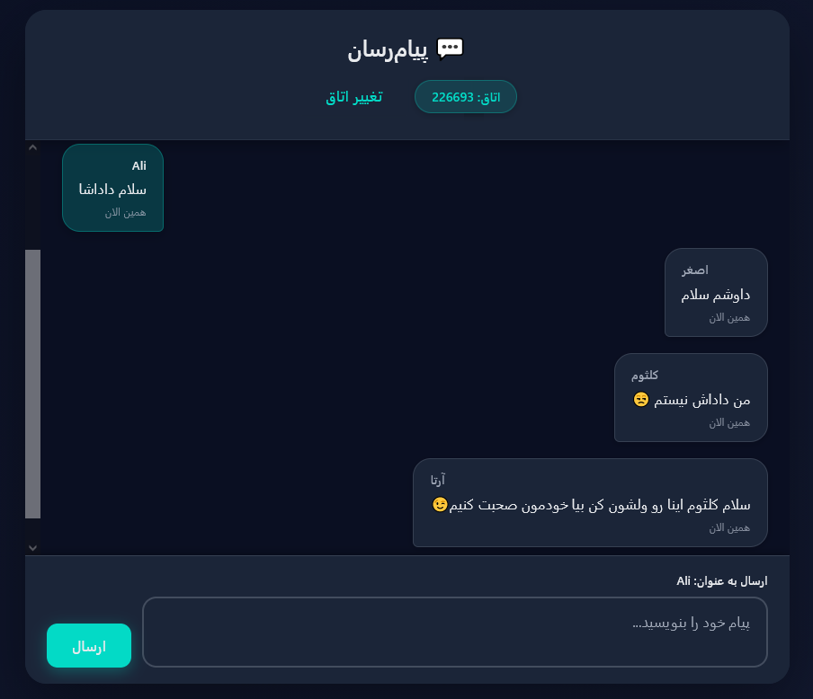

# 💬 سیستم پیام‌رسانی PHP

یک سیستم پیام‌رسانی ساده و مدرن با PHP، MySQL و JavaScript که امکان ساخت و پیوستن به اتاق‌های چت را فراهم می‌کند.

> **💡 نکته:** این پروژه کاملاً با [Cursor](https://cursor.sh) نوشته شده است.

## 📸 Screenshots



## ✨ ویژگی‌ها

- ✅ رابط کاربری مدرن و Responsive
- ✅ پیام‌رسانی لحظه‌ای (Real-time) با AJAX Polling
- ✅ سیستم اتاق‌های چت با کد 6 رقمی
- ✅ رمزنگاری پیشرفته با AES-256-GCM
- ✅ پشتیبانی از انقضای خودکار اتاق‌ها
- ✅ بدون نیاز به ثبت‌نام (استفاده با نام کاربری)
- ✅ طراحی زیبا و کاربرپسند با فونت فارسی
- ✅ امنیت با PDO و Prepared Statements

## 📋 نیازمندی‌ها

- PHP 7.4 یا بالاتر
- MySQL 5.7 یا بالاتر (یا MariaDB)
- Apache/Nginx با پشتیبانی از PHP
- ماژول PDO MySQL در PHP
- Extension OpenSSL برای رمزنگاری

## 🚀 نصب و راه‌اندازی

### روش ساده (توصیه می‌شود) 🎯

1. **فایل‌های پروژه را در پوشه وب سرور خود قرار دهید** (مثلاً `htdocs` در XAMPP یا `www` در Laragon)

2. **مرورگر خود را باز کرده و به آدرس زیر بروید:**
   ```
   http://localhost/install.php
   ```
   یا اگر از پورت خاصی استفاده می‌کنید:
   ```
   http://localhost:8080/install.php
   ```

3. **فرم نصب را پر کنید:**
   - اطلاعات اتصال به MySQL را وارد کنید (معمولاً اطلاعات پیش‌فرض کافی است)
   - روی دکمه "شروع نصب" کلیک کنید

4. **تمام!** 🎉
   - سیستم به صورت خودکار:
     - نیازمندی‌ها را بررسی می‌کند
     - فایل تنظیمات را ایجاد می‌کند
     - پایگاه داده را ایجاد می‌کند
     - تمام migration ها را اجرا می‌کند

5. **به صفحه اصلی بروید:**
   ```
   http://localhost/
   ```

### روش دستی (برای کاربران پیشرفته)

اگر می‌خواهید به صورت دستی نصب کنید:

1. **ایجاد پایگاه داده:**
   ```bash
   mysql -u root -p < sql/schema.sql
   ```

2. **ایجاد فایل تنظیمات:**
   ```bash
   cp config/database.php.example config/database.php
   ```
   سپس فایل `config/database.php` را ویرایش کنید.

3. **دسترسی به سایت:**
   ```
   http://localhost/
   ```

## 📖 نحوه استفاده

1. صفحه اصلی را باز کنید
2. یک اتاق جدید بسازید یا به اتاق موجودی با کد 6 رقمی بپیوندید
3. نام خود را وارد کنید
4. شروع به ارسال پیام کنید
5. پیام‌های دیگران به صورت خودکار هر 2.5 ثانیه به‌روزرسانی می‌شوند

## 📁 ساختار پروژه

```
.
├── index.php                 # صفحه اصلی چت
├── install.php              # نصب‌کننده خودکار (جدید!)
├── api/                      # فایل‌های API
│   ├── create_room.php      # ساخت اتاق جدید
│   ├── join_room.php        # پیوستن به اتاق
│   ├── send_message.php     # ارسال پیام
│   ├── get_messages.php     # دریافت پیام‌ها
│   ├── get_room_info.php    # اطلاعات اتاق
│   └── cleanup_expired_rooms.php
├── config/                   # تنظیمات
│   ├── database.php.example # Template تنظیمات دیتابیس
│   ├── database.php         # تنظیمات دیتابیس (ایجاد می‌شود)
│   └── encryption.php       # ماژول رمزنگاری
├── sql/                      # فایل‌های دیتابیس
│   ├── schema.sql           # ساختار پایگاه داده
│   └── migration_*.sql      # Migration ها
├── assets/                   # فایل‌های استاتیک
│   ├── css/
│   │   └── style.css
│   └── js/
│       └── chat.js
├── fonts/                    # فونت‌های فارسی
├── screenshots/              # اسکرین‌شات‌های پروژه
└── README.md                 # این فایل
```


## 🔒 امنیت

### رمزنگاری پیشرفته

این سیستم از **AES-256-GCM** برای رمزنگاری استفاده می‌کند که:
- **غیرقابل شکستن** است (با کلید مخفی)
- **احراز هویت و یکپارچگی** داده را تضمین می‌کند
- از **IV (Initialization Vector)** یکتا برای هر encryption استفاده می‌کند

### داده‌های رمزنگاری شده

#### 1. رمز اتاق‌ها (room_code)
- رمز اتاق‌ها با AES-256-GCM رمزنگاری می‌شوند
- یک hash (SHA-256) برای جستجوی سریع ذخیره می‌شود
- **بدون کلید مخفی، امکان رمزگشایی وجود ندارد**

#### 2. پیام‌ها (messages)
- تمام پیام‌ها با AES-256-GCM رمزنگاری می‌شوند
- **بدون کلید مخفی، امکان خواندن پیام‌ها وجود ندارد**

### کلید رمزنگاری

کلید رمزنگاری به صورت خودکار در فایل `config/.encryption_key` تولید می‌شود.

#### نکات امنیتی مهم:

1. **هرگز فایل `.encryption_key` را در Git commit نکنید!**
   - این فایل در `.gitignore` قرار دارد
   - اگر به اشتباه commit شد، باید کلید را تغییر دهید

2. **پشتیبان‌گیری از کلید:**
   - از فایل `.encryption_key` پشتیبان بگیرید
   - بدون این کلید، داده‌های رمزنگاری شده قابل بازیابی نیستند

3. **دسترسی به فایل:**
   - فایل کلید فقط باید توسط مالک قابل خواندن باشد (chmod 600)
   - سیستم به صورت خودکار این دسترسی را تنظیم می‌کند

4. **تغییر کلید:**
   - اگر کلید به خطر افتاد، باید تمام داده‌ها را دوباره رمزنگاری کنید
   - این کار نیاز به migration دارد

### امنیت در Production

1. **HTTPS:** همیشه از HTTPS استفاده کنید
2. **کلید مخفی:** فایل `.encryption_key` را در جای امن نگه دارید
3. **پشتیبان‌گیری:** از کلید و دیتابیس پشتیبان بگیرید
4. **دسترسی:** دسترسی به فایل کلید را محدود کنید
5. **لاگ‌ها:** از لاگ کردن داده‌های حساس خودداری کنید

### مشکلات احتمالی

#### خطا: "Encryption failed"
- بررسی کنید که extension `openssl` در PHP فعال باشد
- بررسی کنید که فایل `.encryption_key` قابل نوشتن باشد

#### خطا: "Decryption failed"
- بررسی کنید که کلید رمزنگاری تغییر نکرده باشد
- بررسی کنید که داده‌ها به درستی رمزنگاری شده باشند

## 📚 مستندات بیشتر

- [`LARAGON_SETUP.md`](LARAGON_SETUP.md) - راهنمای نصب در Laragon
- [`CHANGELOG.md`](CHANGELOG.md) - تاریخچه تغییرات

## 🛠️ توسعه

برای افزودن ویژگی‌های جدید:

- **WebSocket**: برای پیام‌رسانی واقعاً لحظه‌ای
- **ثبت‌نام و ورود**: سیستم احراز هویت کامل
- **ارسال فایل**: قابلیت آپلود و اشتراک فایل
- **نوتیفیکیشن**: اعلان‌های مرورگر

## ⚠️ عیب‌یابی

### خطای اتصال به دیتابیس
- مطمئن شوید MySQL در حال اجرا است
- بررسی کنید دیتابیس `chat_db` ایجاد شده باشد
- اطلاعات اتصال در `config/database.php` را بررسی کنید

### صفحه سفید یا خطای PHP
- مطمئن شوید Apache در حال اجرا است
- Extension OpenSSL در PHP فعال باشد
- خطاهای PHP را در error log بررسی کنید

### API کار نمی‌کند
- Console مرورگر را باز کنید (F12)
- Network tab را بررسی کنید
- مطمئن شوید فایل‌های API در پوشه `api` قرار دارند

## 📝 مجوز

این پروژه به صورت رایگان و آزاد در دسترس است.

## 🤝 مشارکت

برای مشارکت در پروژه:
1. Fork کنید
2. یک Branch جدید ایجاد کنید (`git checkout -b feature/AmazingFeature`)
3. تغییرات را Commit کنید (`git commit -m 'Add some AmazingFeature'`)
4. به Branch خود Push کنید (`git push origin feature/AmazingFeature`)
5. یک Pull Request باز کنید

---

**نکته:** قبل از استفاده در Production، حتماً فایل `config/database.php` را با اطلاعات واقعی تنظیم کنید و از HTTPS استفاده کنید.
